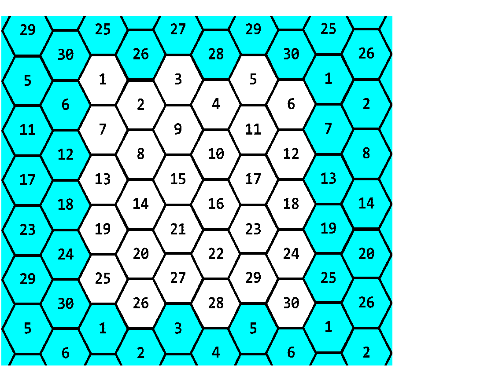

This project was bootstrapped with [Create React App](https://github.com/facebookincubator/create-react-app). You can find the most recent version of this guide [here](https://github.com/facebookincubator/create-react-app/blob/master/packages/react-scripts/template/README.md).

This is a work in progress with missing features and bugs, some listed at the bottom of this document.

# Hunt The Wumpus game
 
This is written for the following specifications for Mr. McTavish's class at Bothell High School.

The Wumpus lives in a cave of 30 rooms.  The rooms are hexagonal.  Each room has up to 3 tunnels leading to other rooms.  The rooms on the edges can be connected to the rooms on the opposite edge. The Diagram below demonstrates the cave layout and numbering (note that the player could travel from room 6 directly to room 30 or room 1, if room 6 connects to them).

## The Cave

You will need to create at least 5 different caves that the user can pick to play in.  Each cave will have different sets of tunnels leading between the rooms such that in some caves you will be able to get between two adjacent rooms that you can’t move between in other caves. There should be no unreachable rooms in any caves.


## Hazards

Bottomless Pits - Two rooms have bottomless pits in them.  If you go there, you fall into the pit.  You can get out of the pit by getting at least 2 out of three trivia questions right.  If you get out of the pit, you will be placed back where you started the game.

Super Bats - Two other rooms have super bats.  If you go there, a bat grabs you and takes you to some other room at random.  After the bat take you to a room, it will fly away to another random room.

No room will have more than one hazard. The Wumpus is not considered to be a hazard.

## Wumpus

The Wumpus is not bothered by the hazards (he has sucker feet and is too big for a bat to lift.)  Usually he is asleep.  Two things wake him up: your entering his room or your shooting an arrow.

If the Wumpus wakes, he sometimes runs to the next room at a random direction.  If you happen to be in the same room with him, you have to fight the Wumpus.

## The Player

Each turn you may move, shoot an arrow, purchase more arrows, or purchase a secret.  

- Move: You can move one room at a time.

- Arrow: You start with 3 arrows.  If you ever run out of arrows without killing the Wumpus, you lose.  Each arrow can be shot into an adjacent room.  You aim by telling the computer which room you want to shoot into.  If the arrow hits the Wumpus, you win.

- Purchase Arrows: You can purchase 2 more arrows by getting at least 2 out of three trivia questions right.

- Purchase a secret: You can purchase a secret by getting at least 2 out of three trivia questions right.  The secrets range from not very useful to very useful.  You can be told the room number where a bat lives, where a pit is, if the Wumpus is within 2 rooms of you, or the room number where the Wumpus is currently.  However, you might also be told what room number you are currently in or the answer to a trivia question you have gotten wrong.

## Warnings

When you are one room away from Wumpus or hazard, the computer says:

- Wumpus - I smell a Wumpus!
- Bat - Bats Nearby
- Pit - I feel a draft

## Fighting the Wumpus

If you wind up in the same room as the Wumpus you must get 3 out of 5 trivia questions correct.  This only wounds the Wumpus, though.  He doesn’t like to get beat in a fight and will run at least 2 rooms away, but can run up to 4 rooms away if he loses a fight.  If he wins the fight, you lose the game.

## Money and Trivia

On every turn that you move through a tunnel, you will be given a gold coin and be told a piece of trivia.  There are 100 gold coins to collect in total.  Every time throughout the game that you have to answer a trivia question it will cost you a coin to attempt to answer the question.  Whether you get it right or wrong, it costs you one coin and you will never be asked that question again before the end of the game.  If you ever run out of coins, you lose.

Conflicts occur at various times in the game, such as encounters with the wumpus.  These conflicts are resolved in this specification by asking the user to answer trivia questions.

Replacing trivia with a different mini-game is allowable in a limited way: you MUST implement trivia first.  Once you have demonstrated a working trivia implementation to your mentors, they may give you permission to begin working on a replacement mini-game.  You can use the mini-game to resolve falling into pits, conflicts with the Wumpus, and to purchase arrows and secrets.  However you must integrate it into all aspects of the game where trivia is mentioned in this spec; for example at times when you would be told a piece of trivia, you might instead be given a hint or bonus for the mini-game.

## Scoring

The object is to kill the Wumpus in as few moves as possible.  If you do, you will get 100 points!  If you kill the Wumpus, your score will be computed with the following equation:

```100 points – N + G + (10*A)```

- N = number of turns
- G = number of gold coins you have left
- A = number of arrows you have left

The top 10 scores should be kept on file and include all of the information that made up the score (N, G, and A) as well as the player’s name and which cave was played.

## User Interface

At a minimum, the user interface should include a bird’s eye (looking from the ceiling of the room on down) view of the room you are in and an accurate depiction of the tunnels and which rooms they lead to.  You will need to display at all times the number of coins the player has collected, the number of turns the player has taken,  and the number of arrows the player has left.

You will also need to consider designing a user interface which will need to display secrets, hints, trivia information, trivia questions, number of correct trivia questions and number of questions needed for the current goal (at least when answering questions) and allow for user input when necessary.

You will need to record the players name and let them choose which cave they want to play in before the game starts.

When not playing, the top 10 high scores should be displayed and pressing enter starts the game.

## Missing Features and Bugs of Note

- Secrets engine not implemented
- Scoring not implemented
- High score engine not implemented
- Hints engine not implemented
- Fighting the wumpus is not implemented
- Arrows will not be awarded after answering trivia questions
- Trivia questions will be downloaded whenever the trivia dialog gets brought up. There is no trivia queue.
- Correct answers for trivia questions will always be the last item because the questions are so hard I can't possibly answer them properly.
- Hazards can be in the same room. Not checking if multiple pits or multiple bats are the same randomly chosen room - also not checking if the bats are in the same room as a pit.
- Alternative Room view not finalized or implemented
